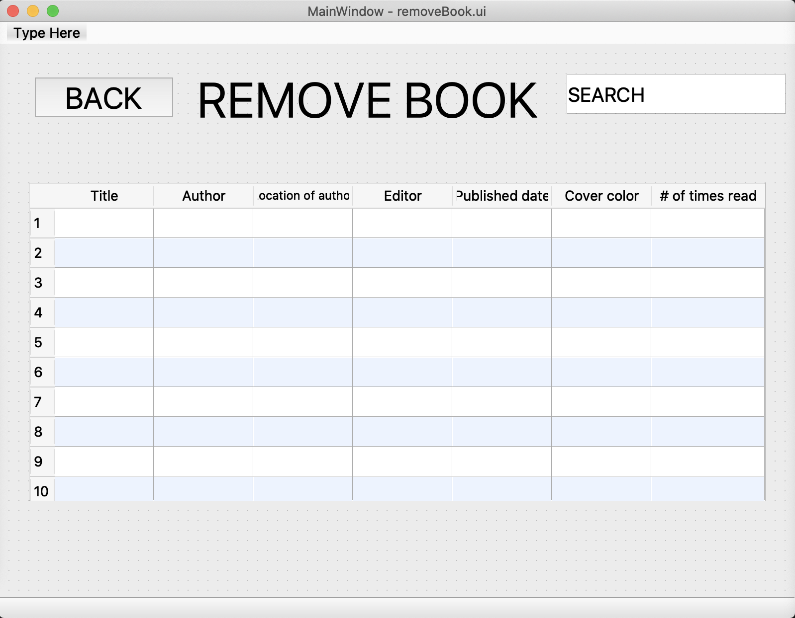
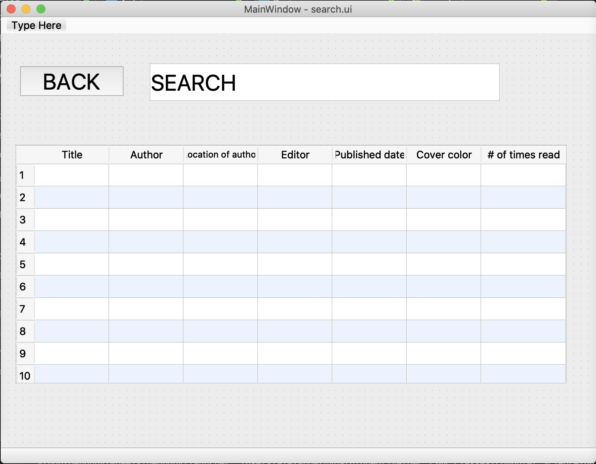

# Unit 3

# Inventory project UNIT 3

## Criteria A - Planning

### Identifying the client
The client is Christ Precieux (CP), a student attending UWC ISAK Japan. CP currently owns a collection of books, which are completely unorganised. All of his books have certain characteristics which he wants to document and categorise, such that it is easier for him to understand and be aware of his book collection at all times. Currently, there is no system in place to handle this organisation. The client wants to be able to keep track of the characteristics of books including:
* Title
* Authors
* Continent and nationality of author
* Editor
* Cover color
* Date of publication
* How many times the book has been read

The client also wants to be able to search for books based on the categories above. A search algorithm must be implemented, which quickly displays the most relevant results divided into each individual category, based on a given search term. 

No timeline has been given by the client. However, at this stage, as the developer, I have put an estimated completion date for **April 30th**. 

### Table of planning
This table shows completed and planned tasks which are of significant importance. This includes for example consultations with the client and development milestones:
| Task No | Planned Action                                      | Expected outcome                       | Time   | Target completion | Evidence        |
|---------|-----------------------------------------------------|----------------------------------------|--------|-------------------|-----------------|
| 1       | Planning: Meeting with client                       | Identify the client requirements       | 30 min | 12. Feb 2020      | Email exchange  |
| 2       | Development: Create a secure login system in Python | Finished login program                 | 20 min | 13. Feb 2020      | Program         |
| 3       | Planning: Confirming success criteria               | Confirm success criteria by the client | 10 min | 14. Feb 2020      | Voice recording |

### Explicit consultation with client (reference appendix)
See the link below to read the explicit consultation with the client. This section is located beneath the heading *"My role as a developer"*.

[Client Requirements and Design Brief](clientRequirementsAndDesignBrief.md)

The success criteria of the project was confirmed by the client on 14. Feb. Evidence of this discussion can be found through this voice recording of the interview:

[Confirming success criteria - An interview](successCriteria.m4a)


### Choose and justify a solution
My solution will be an **offline graphical user interface (GUI) software program built in Python**. Following are points explaining and justifying the main characteristics of my solution:
* Offline - It will be locally accessible on one computer/device, with no server/host interraction needed. I chose this because of the added security this entails, and because there is no need. Server requirement was not specified by client, thus there is no demand. 
* Graphical User Interface - The program will **not** be terminal based as used previously, but rather with a visual display. There will for example be buttons instead of commands, easier input of information (with text input fields) and graphical pictures of book covers etc. A simple but efficient user interface is a significant improvement of the usability of the program for the user, compared to a terminal-based program.
* Python - I will be building this project in Python. The reason for this is purely preferential, in addition to the requirement of the assignment. Python has libraries very suitable for GUI programs, in addition to very efficient and easy-to-use data handling techniques. This choice results in an easier job for me, the developer, in contrast to using other lower-level languages. However, an argument against this choice would be that the device running the program (the client) is required to have python 3.x and every library needed pre-installed. This is a clear disadvantage. However, as a developer with the knowledge of my clients hardware/software situation, I know that the receiving device (the computer which will run the program) has all of this already installed. 

**The program will have the following functionality:**
* Adding books
  * Creating a new book
  * Getting the information in the different categories through user input
* Removing books
  * Deleting a book
* Editing books
  * Changing information about a book
* Searching for books
  * Giving results based on an inputed search term
  * Separated and sorted based on the categories
  * Relevance is prioritised


### Criteria for success based on feedback

Success criteria in order of priority. These criterias have been consulted with and confirmed by the client.

* Secure login
  * Custom username
  * Encrypted password
* Having categories for book characteristics
  * Title
  * Authors
  * Continent and nationality of author
  * Editor
  * Cover color
  * Date of publication
  * How many times the book has been read
* Adding books
  * Easy input within GUI
* Removing books
  * One-button click (with a yes/no confirmation)
* Search for a book
  * Displaying results in less than 1 sec
  * Results in each category
  * Intuitive display of results (most important and relevant first)
    * Prioritizes Titles, authors
    * Displays most frequently read first

### TELOS Principle

The feasibility report based on the TALOS principles can be found in the TELOS.md file.

It can be found here: 

[TELOS feasibility report](TELOS.md)

## Development

### Secure login program
An essential part of the program, and the top priority on the success criteria list, is implementing a secure login method. As mentioned previously the client is the only one with access to this program, and therefore an encrypted and secure password lock is crucial. Below are the most important and relevant parts of the code needed to accomplish this, including explanations.

**Getting a password, and confirming it**
When signing up, the user picks a password. To ensure that no typos occured, the user must re-enter the password to verify it. 
```.py
confirmed = False
while not confirmed:
    password = input("Enter password: ")
    c_password = input("Confirm your password: ")
    confirmed = True if password == c_password else False
print("Password confirmed")
```
*Note the last line, in which a **Pythonic** practice is used - meaning - efficient compression of code into fewer lines. The boolean `confirmed` is only changed to true if the `if` statement is met. `Else`, it is not changed. The loop continues until the password is confirmed.*

**Encrypting the password string**
```.py
import os
import hashlib

salt = os.urandom(32) # this creates a 32 bytes
key = hashlib.pbkdf2_hmac("sha256", str(password).encode("utf-8"), salt, 1000)
```
To encrypt the password string both libraries `os` and `hashlib` must be imported.
`salt` is assigned as a string of size random bytes suitable for cryptographic use. More information can be found [here](https://www.geeksforgeeks.org/python-os-urandom-method/). In this example, the random string is 32 bytes.
`key` holds the encrypted password. The module `hashlib.pbkdf2_hmac()` is used with the secure hash algorithm SHA256. More information about this library and module can be found [here](https://docs.python.org/3/library/hashlib.html).

To display the encrypted password as a hexadecimal value, one must simply do as follows:
```.py
import binascii
print(binascii.hexlify(key))
```
The `binascii` library is capable of translating the key to hexadecimals.


### Design of the UI
The design of the User Interface was created in the program QtDesigner, an application that assist in visualizing the components and layout of the PyQt5 python library. The program ensures that making dynamic and beautiful applications easier.

Multiple designs were required for my program, with the different windows outlined in the list below:
* Homescreen - overview over book collection and access to other pages (via buttons)
* Login page - user enters credentials and is either granted or refused access into the system (this is the first page the user encounters, because a login is always required)
* Register page - allows the user to add his/her personal details the first time the program is used
* Add book page - user can add a book
* Remove book page - user can remove a book
* Search page - user can sort through the collection to find a specific book using a keyword

**All the designs are shown below, in the same order.**

### Homescreen
The homescreen has 
* 1 title
* 1 main table with all the books and 
* 3 buttons navigating to the pages
  * Add book
  * Remove book
  * Search


<div style="display: flex">
  <div style="flex: 50%; padding: 100px">
    
  </div>
  <div style="flex: 50%; padding: 5px">
    
  </div>
</div>


<br>

### Login Page
The login page has 
* One title 
* 2 input fields for 
  * Username 
  * Password
* 1 button that checks the input of the user and possibly navigates to the home screen
* 1 button that opens the register window
* 1 exit button


<br>
<br>
<br>

### Regiser Page
The register page has
* 1 title
* 4 input fields for
  * Email
  * Username
  * Password
  * Verify password
* 2 buttons
  * Registering - chekcing and adding the user information
  * Exit the register window


<br>
<br>
<br>

### Add book Page
The add book page has
* 1 title and 1 subtitle
* 8 input fields
  * Title
  * Author
  * Editor
  * Continent
  * Cover color
  * Nationality
  * Publication date
  * Number of times read
* 2 buttons
  * Add the book
  * Cancel
  


<br>
<br>
<br>

### Remove book Page
The remove book page has
* 1 title
* 1 table for all the books
* 1 search field, which will limit books
* 1 back button, navigating back to the home page




<br>
<br>
<br>

### Search Page
The search page has
* 1 search bar
* 1 back button, navigating back to the home page
* 1 table with the filtered books 





### Integrating a Database
A key component of the book inventory system is that it stores information on each book. This has to be achieved through a database, such that the information can be kept between user sessions. While database solutions such as SQL and SQLite could be chosen, a more practical and lightweight solution will be suitable for such a small-scale project. Thus, a `.csv` file is used to store the data, which can be accessed through the `csv` library in python (`import csv`).

This data must be loaded into the table on the main page. Below is a code snippet showing how the data is stored for later use and how the table is filled out:
```.py
def load_data(self):
    # Here we read the db.csv file
    data = []
    with open("db.csv") as dataBase:
        file = csv.reader(dataBase, delimiter=",")
        for i, row in enumerate(file): # Gets all the rows, with index 0
            for j, col in enumerate(row):
                data.append([i,j,col]) # Creates a data-matrix that can be edited later
                if i != 0: # Does not add the 0th index to the table (this is just titles)
                    self.tableBooks.setItem(i-1,j,QTableWidgetItem(col)) # Append to the table at index i-1, j
```
*Note: The `csv.reader()` method is essential here. It is important to note how this is used. While it returns a iterable (saved as `file`), this is not a list. It cannot be sliced using `[1:5]`, for example.*

The `enumerate(ITERABLE)` function returns both the iterable, combined with the index of that value. In `for i, row in enumerate(row):`, the index is stored in `i`, and the value in `row`.


### Registering a user
Both when the user first starts the program and when new users want to create an account, the registration of login credentials are required. These variables are given by the user and outlined below, along with the necessary requirements and constraints on the inputs themselves
* Email
  * Must include a "@" to be confirmed as an email address
* Username
  * Must only be letters and have a length greater than 5
* Password
  * Must be greater than 5 characters and equal to the verification field below
* Verifying password
  * Another input of the password, to verify that the user knows his/her password. Both must be equal
  
**All 3 of these parameters (email, username and password) must be confirmed and within the requirements before the information is stored. **

However, the user is given more tries. When an input is wrong, the UI gives a visual response in the form of changing the color of the border of the input field. For example, in the method `validate_email()`:
```.py
if "@" not in email:
    self.emailInput.setStyleSheet("border: 1px solid red") # Changes the border
    return False
```
Similar tests and visual altercations are used for the other inputs.

The most important method in this process is `store()`. This method is shown below with explanations and information on its functionality.

1. The email and password from their separate input fields (referenced using the ID of the fields, `emailInput` and `passwordInput`) are collected and stored in variables.
1. The email and password are hashed (encrypted) together using the `hash_password` function. Both the email and password are passed in because the application will later check if the login information (an email and password) match the registration information. The combined hash is stored in the variable `msg`
1. All encrypted user credentials are stored in a text file named `Outputs.txt`. That file is opened and the `msg` is written to a new line.
1. The registration window closes with the `self.close()` method


The full code is shown here:
```.py
def store(self):
    email = self.emailInput.text()
    password = self.passwordInput.text()
    print("hashing", email + password)
    msg = hash_password(email + password)
    with open("Output.txt", "a") as output_file:
        output_file.write("{}\n".format(msg))
    self.close()
```

### Logging a user in
To log a user in, the user must provide an email and password which will be checked against the database of user credentials.

The code is explained below:

1. The inputted email and password are stored
1. The `Output.txt` file is opened and a for-loop iterates through the encrypted credentials
1. The `verify_password()` function is used to compare every stored password in the text file to the inputted `email + password`
1. If they are equal, the window closes (thus the user gains access to the main window) and they are logged in
1. If no credentials match, a pop-up is displayed showing an error message, and inputs are cleared

```.py
def try_login(self):
    email = self.emailInput.text()
    password = self.passwordInput.text()
    with open("Output.txt", "r") as passwordFile:
        for storedPassword in passwordFile:
            if verify_password(storedPassword, email + password):
                self.close()
                return
        QMessageBox.about(self, "Error", "Error: Wrong password")
        self.emailInput.clear()
        self.passwordInput.clear()
```


## Evalutation

## Improvements


