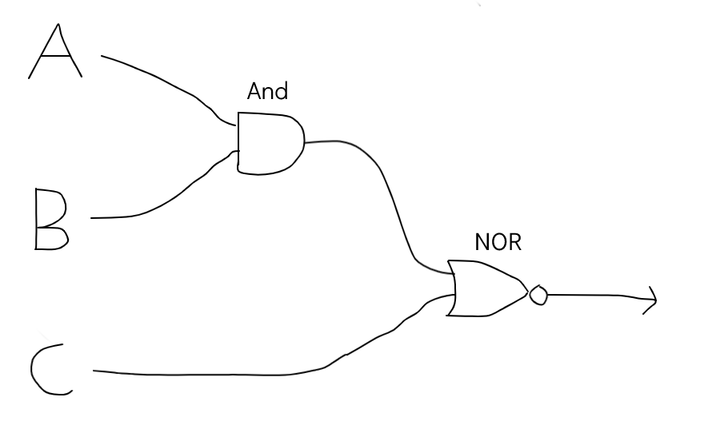

# Answer to syllabus questions:

 
## Q1. Outline one usability issue associated with the design of mobile devices.
One usability issue with mobile devices is limited processing power. The hardware of mobile devices must be substantially reduced due to a critical limitation of both space and energy resources (battery capacity).

## Q2. Construct a truth table for the following Boolean expression. 
#### (A AND B) NOR C

## Q3. Define the term protocol.
A set of rules and guidelines responsible for outlining the procedure for data exchanges between clients.

## Q4. Outline the role of the memory data register in the machine execution cycle. 
The memory data register is a buffer (where data can be stored temporarily) between the CPU and the RAM of the computer. It is located inside the processor.

## Q5. A code for representing colours is used, where each colour is stored using 7 bits. State the number of different colours that can be represented.
